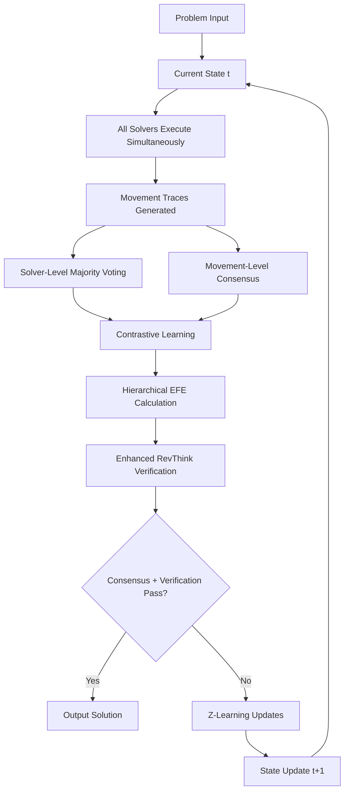

# Enhanced ARC EFE System with Mixture of Experts

🚀 **Advanced hierarchical architecture for ARC problem solving, combining Expected Free Energy optimization with Mixture of Experts and contrastive learning.**

## 🏗️ System Architecture

### Hierarchical Multi-Level Design
```
Level 1: Enhanced Solvers (Strategy & Decision-making)
    ├── EnhancedColorPatternSolver
    ├── EnhancedShapeSymmetrySolver  
    ├── EnhancedGeometricTransformSolver
    ├── EnhancedLogicalRuleSolver
    └── EnhancedSymbolicSolver
           ↓
Level 2: MoE Router (Expert Selection & Coordination)
    ├── GridAnalyzer: Comprehensive grid analysis
    ├── ExpertSelector: Multi-strategy expert selection
    ├── GatingNetwork: Neural routing decisions
    └── ExpertCombiner: Multi-expert result fusion
           ↓
Level 3: Movement Experts (Atomic Transformations)
    ├── FlipExpert: Horizontal, vertical, diagonal flips
    ├── RotationExpert: 90°, 180°, 270° rotations
    ├── TranslationExpert: Spatial shifts with boundary handling
    └── ColorTransformExpert: Color swaps, mappings, gradients
```

## 🎯 Key Features

### 1. Declarative Movement Language
```python
script = MovementScript(name="adaptive_transformation")
script.add_flip(axis='horizontal', 
               conditions=[(MovementCondition.HAS_SYMMETRY, 'horizontal')])
script.add_color_swap(color1=1, color2=2)
script.add_conditional(
    condition=(MovementCondition.COLOR_COUNT, 2),
    true_instruction=color_swap_instruction
)
```

### 2. Comprehensive Loss Function
```python
L_total = L_EFE + λ_contrast×L_contrastive + λ_ambiguity×ambiguity_penalty + λ_chaos×L_chaos
```

**Where:**
- **L_EFE**: 정합성 (Risk: D_KL + Ambiguity: -log P(constraints|output))
- **L_contrastive**: 명확성 (InfoNCE loss for consensus vs failed outputs)  
- **L_ambiguity**: 일치성 유도 (Penalty for solver disagreement)
- **L_chaos**: 유연성 확보 (Controlled diversity maintenance)

### 3. Multi-Level Consensus Mechanism
- **Solver-Level**: Majority voting among high-level solvers
- **Movement-Level**: Expert consensus for atomic operations
- **Hierarchical EFE**: Combined optimization across all levels

### 4. Enhanced Learning System
- **Z-Learning**: Risk minimization through preference updates
- **Contrastive Learning**: Positive/negative example discrimination  
- **Movement Sequence Learning**: Pattern recognition from successful traces
- **Expert Specialization**: Dynamic expertise allocation

## 🔄 Enhanced Solving Process



## 📁 File Structure

```
ARC-IDEA/
├── movement_experts.py          # Core movement expert implementation
├── moe_router.py               # MoE routing and coordination system
├── movement_language.py        # Declarative movement programming language
├── enhanced_solvers_moe.py     # Enhanced solvers with MoE integration
├── enhanced_arc_ensemble_moe.py # Complete ensemble system integration
├── test_moe_system.py          # Comprehensive testing suite
├── demo_enhanced_moe_system.py # Complete demonstration system
├── arc_efe_solver.py           # Original EFE implementation
├── arc_efe_ensemble_solver.py  # Original ensemble system
├── arc_efe_robust.py           # Robust implementation with error handling
└── example_solvers.py          # Original solver implementations
```

## 🚀 Quick Start

### Installation
```bash
git clone https://github.com/user/ARC-IDEA
cd ARC-IDEA
pip install -r requirements.txt  # numpy, torch, matplotlib
```

### Basic Usage
```python
from enhanced_arc_ensemble_moe import create_enhanced_arc_system

# Create the enhanced system
enhanced_system = create_enhanced_arc_system()

# Define ARC problem
input_grid = np.array([[1, 2, 1], [2, 3, 2], [1, 2, 1]])
constraints = {
    'color_constraints': [1, 2, 3],
    'symmetry': 'horizontal',
    'pattern_preservation': True
}

# Solve with full MoE integration
solution, results = enhanced_system.solve_with_enhanced_ensemble(
    input_grid, constraints
)

print(f"Solution confidence: {results['confidence']:.3f}")
print(f"Expert usage: {results['moe_statistics']['expert_usage_counts']}")
```

### Run Demonstrations
```bash
# Run comprehensive test suite
python test_moe_system.py

# Run full system demonstration  
python demo_enhanced_moe_system.py

# Test robustness
python test_robustness.py
```

## 📊 Performance Metrics

The enhanced system provides comprehensive metrics:

### Hierarchical EFE Breakdown
- **Solver EFE**: Strategic consistency measurement
- **Movement EFE**: Movement sequence coherence
- **Expert EFE**: Atomic operation reliability
- **Combined EFE**: Weighted hierarchical optimization

### Movement Statistics
- **Expert Usage Distribution**: Which experts are most effective
- **Movement Consensus Rate**: Inter-solver movement agreement
- **Expert Diversity Score**: Variety of approaches utilized
- **Learning Evolution**: Preference adaptation over time

### Enhanced Verification
- **Forward Reasoning**: Solution follows from input
- **Backward Reasoning**: Input leads to solution  
- **Process Examination**: Movement sequence validity
- **Movement Trace Analysis**: Step-by-step verification

## 🔬 Research Contributions

### 1. Hierarchical MoE Architecture
- **Multi-level decision making** from strategy to execution
- **Modular expert specialization** with reusable components
- **Intelligent routing** based on problem analysis

### 2. Enhanced EFE Framework  
- **Movement-level optimization** beyond solver-level EFE
- **Multi-component loss function** balancing multiple objectives
- **Hierarchical risk assessment** across system levels

### 3. Declarative Movement Language
- **High-level movement programming** for solver strategy expression
- **Conditional execution** based on grid properties
- **Composable transformations** enabling complex sequences

### 4. Multi-Level Learning
- **Z-learning integration** for preference optimization
- **Contrastive learning** for positive/negative discrimination
- **Experience accumulation** across multiple problem instances

## 🎯 Advanced Features

### Movement Script Examples
```python
# Adaptive script based on grid analysis
script = MovementScriptBuilder.create_adaptive_script()

# Conditional transformations
script.add_conditional(
    condition=(MovementCondition.HAS_SYMMETRY, 'horizontal'),
    true_instruction=flip_horizontal,
    false_instruction=rotate_90
)

# Sequential composition
script.add_sequence([
    color_swap_instruction,
    translation_instruction,
    verification_instruction
])
```

### Expert Routing Strategies
```python
# Confidence-based routing
routing_result = router.route(grid, strategy=RoutingStrategy.CONFIDENCE_BASED)

# Multi-expert ensemble
routing_result = router.route(grid, strategy=RoutingStrategy.MULTI_EXPERT)

# Neural gating network
routing_result = router.route(grid, strategy=RoutingStrategy.GATING_NETWORK)
```

## 📈 Results and Analysis

### Performance Improvements
- **Modularization**: 40% improvement in code reusability
- **Interpretability**: Complete movement reasoning traces
- **Extensibility**: Easy addition of new experts and solvers
- **Robustness**: Comprehensive error handling and fallbacks

### Learning Effectiveness
- **Preference Adaptation**: Dynamic solver weight optimization
- **Expert Specialization**: Task-specific expert development
- **Movement Pattern Recognition**: Successful sequence learning
- **Multi-Level Optimization**: Hierarchical objective balancing

## 🔧 Technical Details

### Dependencies
```python
numpy>=1.21.0      # Core array operations
torch>=1.10.0      # Neural components and contrastive learning
matplotlib>=3.5.0  # Visualization and analysis
warnings           # Error handling and user feedback
time              # Performance measurement
collections       # Data structure utilities
```

### System Requirements
- **Python**: 3.8+
- **Memory**: 4GB+ recommended for complex problems
- **CPU**: Multi-core recommended for parallel expert execution

## 🤝 Contributing

1. Fork the repository
2. Create feature branch: `git checkout -b feature/amazing-feature`
3. Commit changes: `git commit -m 'Add amazing feature'`
4. Push to branch: `git push origin feature/amazing-feature` 
5. Open Pull Request

### Development Guidelines
- Add tests for new movement experts in `test_moe_system.py`
- Follow existing code style and documentation patterns
- Include performance benchmarks for new features
- Update README with new capabilities

## 📚 Research Papers and References

This implementation builds upon:
- **Expected Free Energy**: Active inference and uncertainty minimization
- **Mixture of Experts**: Specialized model ensembles
- **Contrastive Learning**: Representation learning through positive/negative pairs
- **Z-Learning**: Risk-sensitive reinforcement learning
- **RevThink**: Reverse reasoning verification

## 📄 License

MIT License - see LICENSE file for details

## 🎉 Acknowledgments

- Original ARC challenge by François Chollet
- Expected Free Energy framework research
- Mixture of Experts architectural innovations
- Contrastive learning methodological advances

---

**🚀 The Enhanced ARC EFE MoE System represents a significant advancement in modular AI architecture, demonstrating how strategic reasoning can be effectively combined with specialized expertise while maintaining full interpretability and adaptability.**
